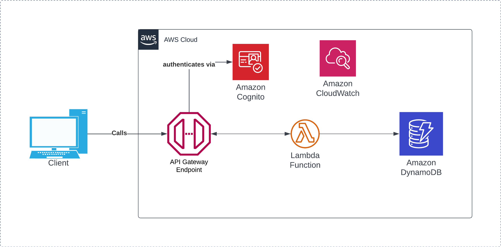

# AWS Learning Project - Creating a serverless API



## Project Overview
The purpose of this project is to create a serverless API that can allow for basic CRUD operations, using lambda functions written in Python which calls to a basic DynamoDB table, and restricting access to API through the use of an API key.

### Project Outcome
By the end of the project I should gain a decent understanding on how to configure API gateway, including the ability to create a RESTful API including documentation on Swagger.

### Project Outputs
- Terraform Scripts which contains all AWS resources provisioned
- Python script for all relevant lambda functions
- Notes on API Gateway best practices and architectural considerations

## Out of Scope
- Updating items using the API
- Using vault / KMS secrets to protect cognito credentials, that is coming in another project!
- Utilizing full RESTful practices

## Project Description

For all of these one-off projects, everything is encapsulated in a brand new AWS account which is then destroyed upon project completion, I would then access the account in Terraform using the `OrganizationAccountAccessRole` in order to prevent any extra configuration in the AWS CLI.

In this project, I spun up an API Gateway instance that, based on the call received by curl, route the call to a lambda function that would interface with DynamoDB and return the results back to the user.

In order to add a layer of protection to the API, I configured a Cognito user pool to generate a JWT token upon a successful authentication call, which is passed in the header of the API call.

I then have Cloudwatch Logs enabled for debugging purposes.

### Pricing
This project did not cost me anything to create and test as all my usage fell under the free tier and was not intensive enough to breach any thresholds.

## Learning from the Project

### Creating accounts and provisioning resources in Terraform
It currently doesn't seem to be possible to create a new AWS account and provision the necessary resources in the same Terraform file, meaning you need to create the AWS account first in one folder, and then in the main terraform configuration, pass in the following:

```hcl
provider "aws" {
	assume_role {
		role_arn = "arn:aws:iam::<new_account_id>:role/OrganizationAccountAccessRole"	
	}
}
```

The account id can be easily found by logging into the aws console and getting the account id from there, although I imagine you could probably log the output of the account creation to a file and have the `<new_account_id>` reference that file. For ease, I have not done that here.

### Packaging Lambda Functions
Lambda functions have to be zipped! So that means when creating a lambda function and you're referencing a separate file, you need to create a data source similar to the following:

```hcl
data "archive_file" "zip_lambda_post" {
	type = "zip"
	source_dir = "../Python Scripts/put_item.py"
	output_path = "${path.module}/lambda/put_item.zip"
}
```

In the lambda resource as well, you need to define the handler, which is the name of the main function that will be run by Lambda once triggered.

### Get Items
Within DynamoDB, there are 2 methods of retrieving multiple items from a table, `Query` and `Scan`. For the sake of this project and to keep in line with the AWS guide that I'm using as a benchmark, my `GET /items` call will just run a scan command with no filters and return everything, as the dataset will be low enough not to matter.  

### General Terraform cleanliness
As it's been a while since I've used Terraform, my primary focus has been on getting functional and working code to get the relevant resources provisioned, even if that means that I'm not entirely following Terraform best practices, or using the full capabilities of Terraform. This means that for the likes of API Gateway there is a lot of the same resources being reused. It wasn't a primary goal to create amazing Terraform code, but to create a packaged environment that contains everything needed.

### Understanding the API requests
#### Authentication request to Cognito

In order to create the authentication request with Cognito I used the below request which I saw whilst following Andrew Tarry's guide on integrating Cognito with API Gateway:

```shell
curl --location --request POST "https://cognito-idp.${region}.amazonaws.com" --header 'X-Amz-Target: AWSCognitoIdentityProviderService.InitiateAuth' --header 'Content-Type: application/x-amz-json-1.1' --data-raw '{"AuthParameters": {"USERNAME": "test_user", "PASSWORD": <PASSWORD>}, "AuthFlow": "USER_PASSWORD_AUTH", "ClientId": <CLIENT_ID>}'
```

The Client ID was originally a bit of a challenge to identify until I found it under the "user pool app client" section of the user pool and then I was able to find the necessary attribute that could be outputted in my terraform script.

This then provided a massive long authentication token of which I would only need the access token which I would then pass into my API gateway request, which consisted of the following: 

```bash
curl -X "PUT" -H "Authorization:<AUTH_KEY>" -H "content-type:application/json" -d @<JSON_FILE_LOCATION <API_URI>
```


### Understanding the cryptic error messages from Lambda
Around 50% of my time spent on this project was on debugging how my request was being sent from API Gateway to Lambda due to employing the Lambda Proxy integration, as that impacted whether the `json.loads()` or `json.dumps()` method would be applicable as originally I was getting error messages for both. After much research I realised that I didn't include the `content-type:application/json` header and therefore the json file wasn't being formatted in the correct way for Lambda to be able to deal with.

Once that was fixed, and I was able to get `json.loads()` returning properly where I could then focus on the next issue being configuring the return response properly.

This was a big learning exercise as the error messages being provided by Python / Lambda weren't particularly helpful, and in the case of my purposely including an object in the request that didn't hold a 'name' value, the error message that I received was simply "The Lambda function returned the following error: 'name'" which was originally quite complexing. This may have been down to how I configured the python script however it's really brought home how important graceful error handling is!

### Lambda vs Lambda Proxy Integration
#### Wrapping my head round the difference
When I was researching possible solutions for these error messages, a common theme that came up time and time again was the type of integration I was using, as it had a big impact into how to format your Lamdba function accordingly. As I was using this [AWS Guide](https://docs.aws.amazon.com/apigateway/latest/developerguide/http-api-dynamo-db.html) as a baseline I was using the Lambda Proxy integration, which meant I had to be more considered in how my Lambda function was formatted, especially for the return response below. 
#### What that meant for the return response
As a result of using the Lambda Proxy integration, I learned that it then has certain ramifications for how the return response should be configured to correctly pass back into API Gateway to be returned to the client, with the layout being as follows:

```Python
return {
		"statusCode": 200,
		"isBase64Encoded": true|false,
		"headers": {"Content-Type": "application/json"},
		"body": "return message"
}
```

In prior Lambda functions I was used to `return` being relatively free to include whatever you feel is a necessary response for the user, and so to start off with I was just passing in a `{"statusCode":200}` value, before realising that API Gateway expected the above response format from Lambda. After some minor research to find the solution I was able to correct it and my code was correctly working. 

### Configuring Log Groups
Once I deployed my lambda functions I quickly learned the most important aspect element that I missed was a way of being able to view the results of any API calls beyond {'Message':'Internal Server Error'}. After some digging I found a tutorial on how to enable cloudwatch log groups which would enable me to actually view the error messages being generated by Lambda.

Where I ran into a bit of an issue was working out what values I wanted to view from the logs, in the end I was able to get what I needed from the integration error and event ID values so I used those, but I appreciate a lot more is available that would be better suited for a more standard use case and not just my basic bug fixing.

### Lambda and DynamoDB
The smoothest part of the process which actually didn't require any debugging was the calls that Lambda were making to DynamoDB, and that all worked a treat just following the DynamoDB resource SDK's.
